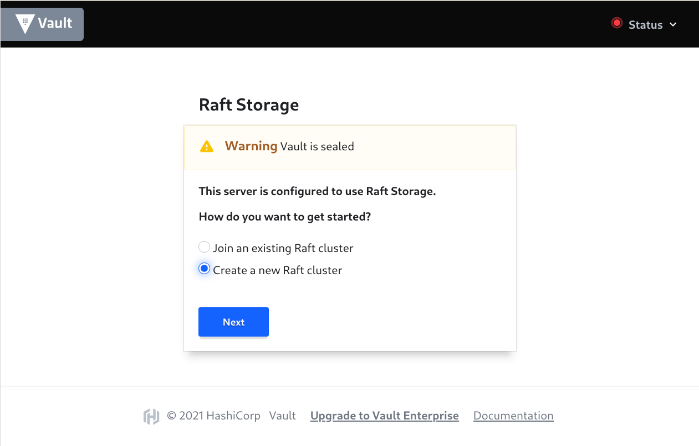
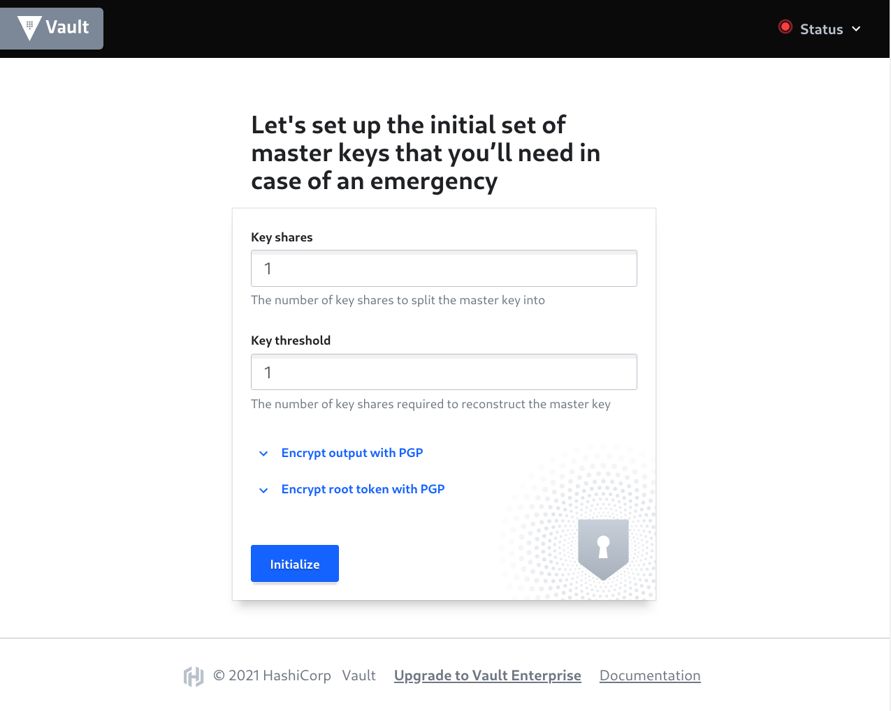
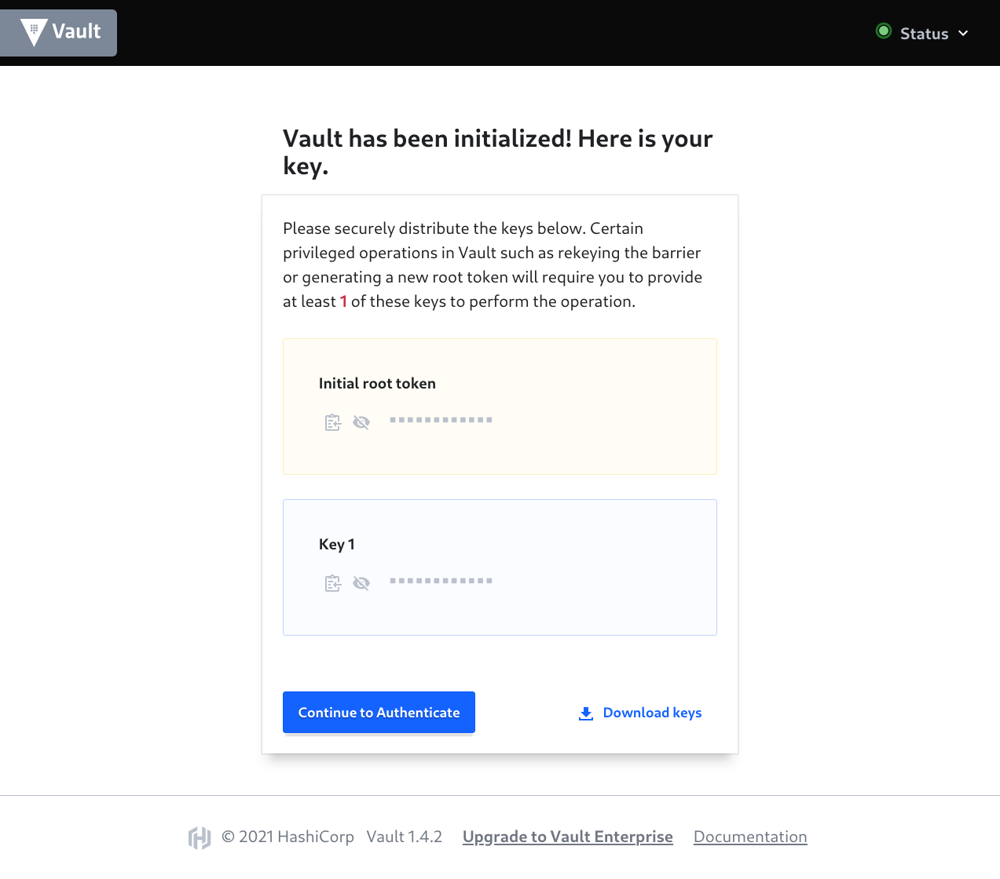
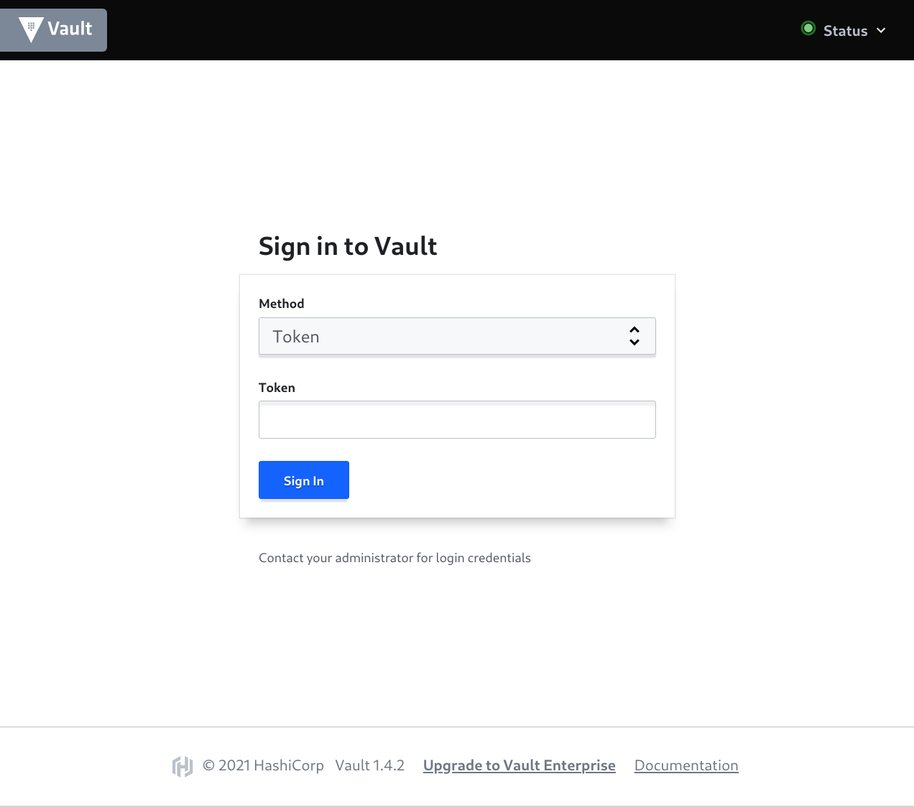

# Initializing the newly created cluster

After applying a Terraform code you should get Cluster URL [cluster_url](https://github.com/binlab/terraform-aws-vault-ha-raft#output_cluster_url). By default, without\* [configuring certificate by ACM](https://github.com/binlab/terraform-aws-vault-ha-raft/blob/master/examples/acm-public-certificate/) it will looks like:

```shell
...
Apply complete! Resources: 70 added, 0 changed, 0 destroyed.

Outputs:

cluster_url = http://tf-vault-ha-basic-alb-123456789.us-east-1.elb.amazonaws.com:443

```

\* *you can configure and use **Vault** cluster without a certificate, but this is strongly **NOT RECOMMENDED** for production usage. How to configure certificate you can read [here](https://github.com/binlab/terraform-aws-vault-ha-raft/blob/master/examples/acm-public-certificate/)*

## Initialization of the cluster created with an enabled [autounseal](https://github.com/binlab/terraform-aws-vault-ha-raft#input_autounseal)

1. Open a cluster URL in a browser and choice *Create a new Raft cluster* and press *Next*

    

1. Enter a number of *sets of master keys*. You can read about init operator [here](https://www.vaultproject.io/docs/commands/operator/init) and concepts [here](https://www.vaultproject.io/docs/concepts/seal). For more secure provisioning a Keys for separate people you can read [here](https://www.vaultproject.io/docs/concepts/pgp-gpg-keybase). Just for example, you can enter *1 key shares* and *1 key threshold*

    

1. For the easiest case just *download unseal keys* and *root token* and go to authenticate screen

    

1. For logging to the **Vault** enter the *root token* got on the previous step

    

