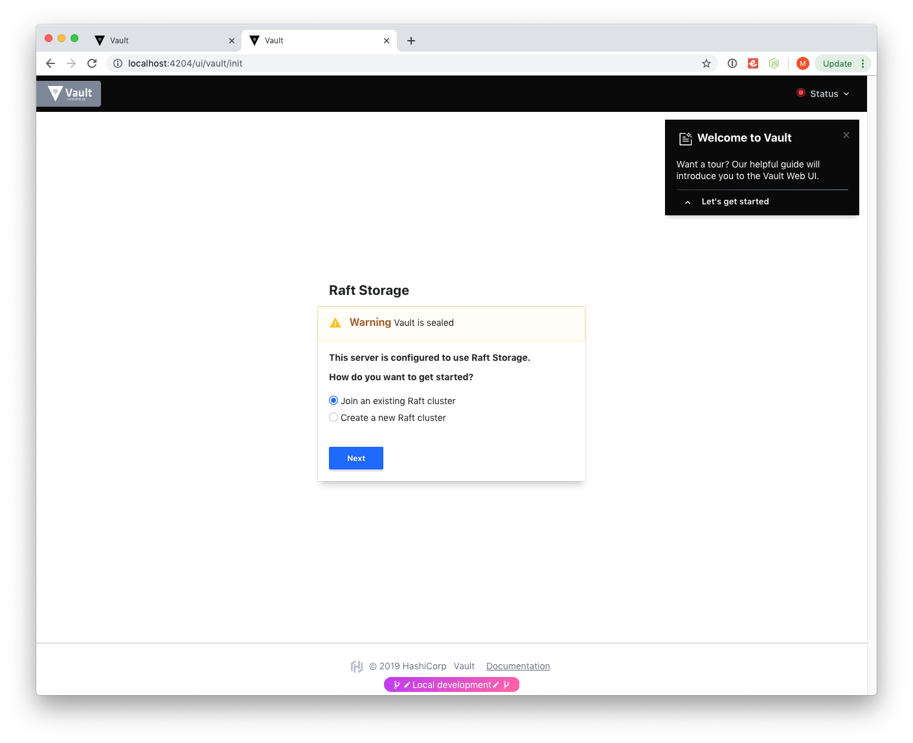
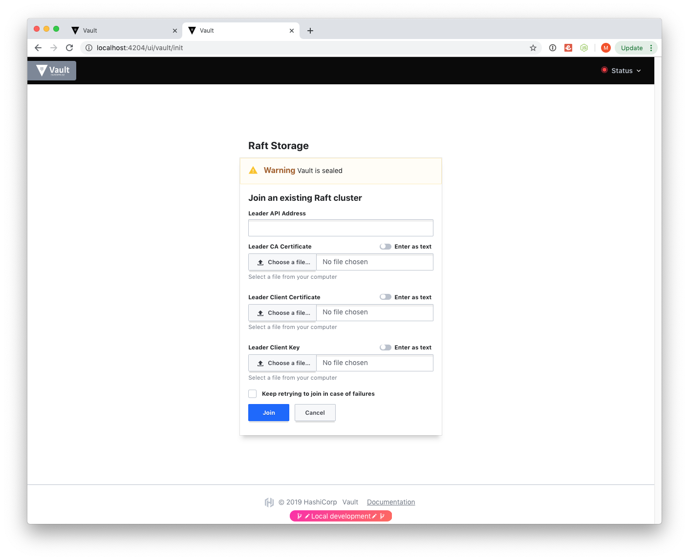
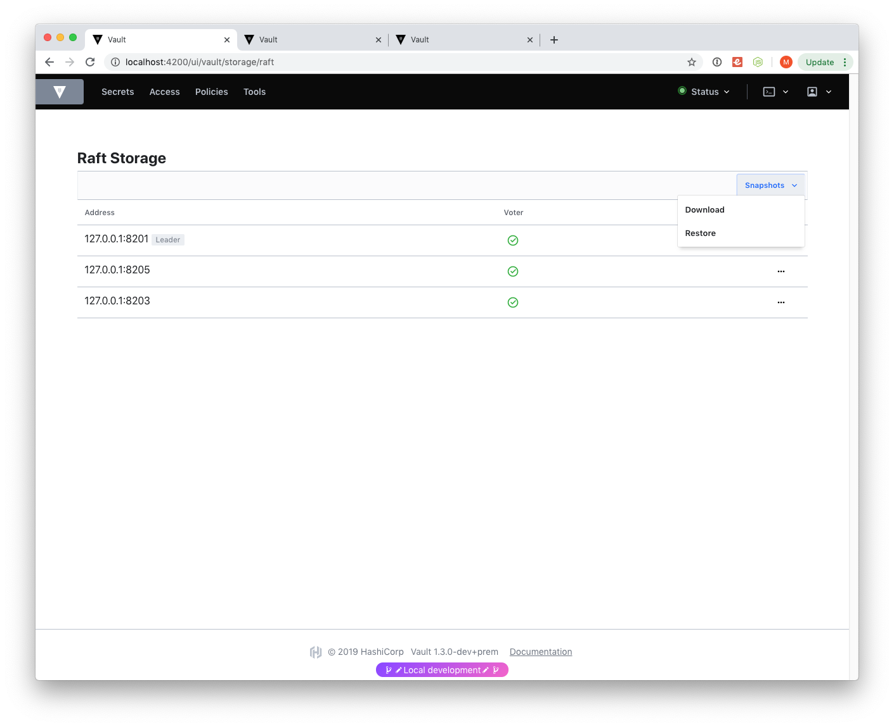
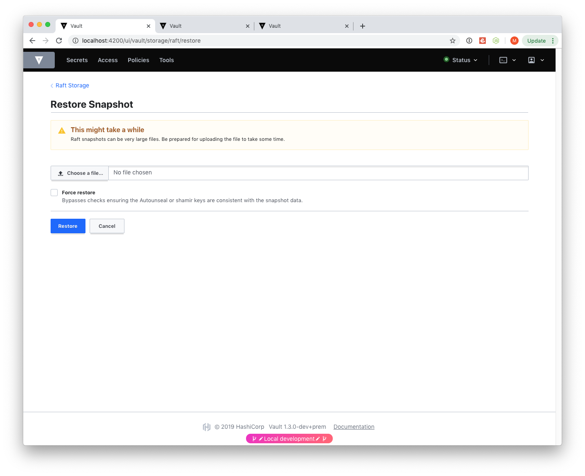

# Vault UI Raft - Init/Join/Backup/Restore 

From a release **Vault** version **1.3.0**, we can use **UI** for **Init**, **Join**, **Backup**, and **Restore** of data. More in [this PR](https://github.com/hashicorp/vault/pull/7410). Convenient to tech team use. Here are some screenshots:

### Raft Init options:

### Raft Join form:

### Raft config:

### Raft Snapshot Restore:

