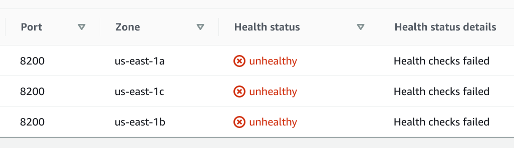
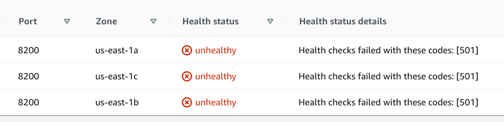
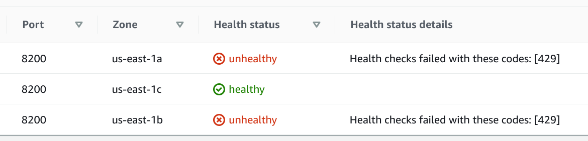

# Troubleshooting

1. AWS indicate - *Health checks failed* (w/o status code)

    | Health status | Health status details |
    |---|---|
    |  unhealthy | Health checks failed |

    

    - **diagnostic**:

        This basically means that the application has not been started. Port (`8200` in this case) is not available for a health check. One of the reasons it might be through the fact that nodes don't have access to **Docker Hub** (Internet access). Up to version `0.1.6` (`0.1.6` included), **NAT Gateway** was [enabled](https://github.com/binlab/terraform-aws-vault-ha-raft/blob/v0.1.6/vpc.tf#L23) by default via VPC module configuration. So no issue with no internet connection before happened

    - **resolution**:

        Please check if the option [nat_enabled](https://github.com/binlab/terraform-aws-vault-ha-raft#input_nat_enabled) is enabled if you are using module version newer than `0.1.6`

1. AWS indicate - *Health checks failed* (w/ status code `501`)

    | Health status | Health status details |
    |---|---|
    |  unhealthy | Health checks failed with these codes: [501] |

    

    - **diagnostic**

        This basically means that the application has been started. Port (`8200` in this case) is available for a health check and the application returns the error code `501`. This is normal behavior for a newly created cluster and has not been yet initialized. 

    - **resolution**

        Just you need is initialize a Vault cluster, detailed see: [Initializing the newly created cluster](https://github.com/binlab/terraform-aws-vault-ha-raft/blob/master/docs/initializing-newly-created-cluster.md)

1. AWS indicate - *Health checks failed* (w/ status code `429`)

    | Health status | Health status details |
    |---|---|
    |  unhealthy | Health checks failed with these codes: [429] |

    

    - **diagnostic**

        This basically means that the application has been started. Port (`8200` in this case) is available for a health check and the application returns the error code `429`. This is normal behavior for initialized and unsealed clusters, but one from all nodes should return status code `200` (`healthy`). 

    - **resolution**

        Just make sure that one of the nodes with the status - `healthy`

1. AWS indicate - *Health checks failed* (w/ some error code)

    You may encounter other status codes, all Vault default codes described in the table [source](https://www.vaultproject.io/api/system/health):

    | Status code | Status code description |
    |---|---|
    | 200 | initialized, unsealed, and active |
    | 429 | unsealed and standby |
    | 472 | disaster recovery mode replication secondary and active |
    | 473 | performance standby |
    | 501 | not initialized |
    | 503 | sealed |

1. In case you encounter trouble that is not described here and you cannot solve please free to open an issue [here](https://github.com/binlab/terraform-aws-vault-ha-raft/issues/new)